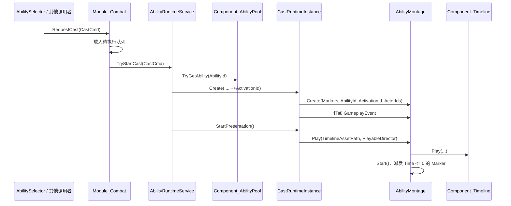
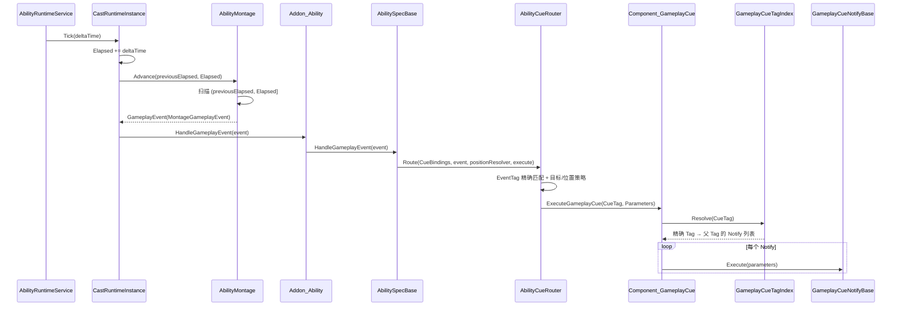
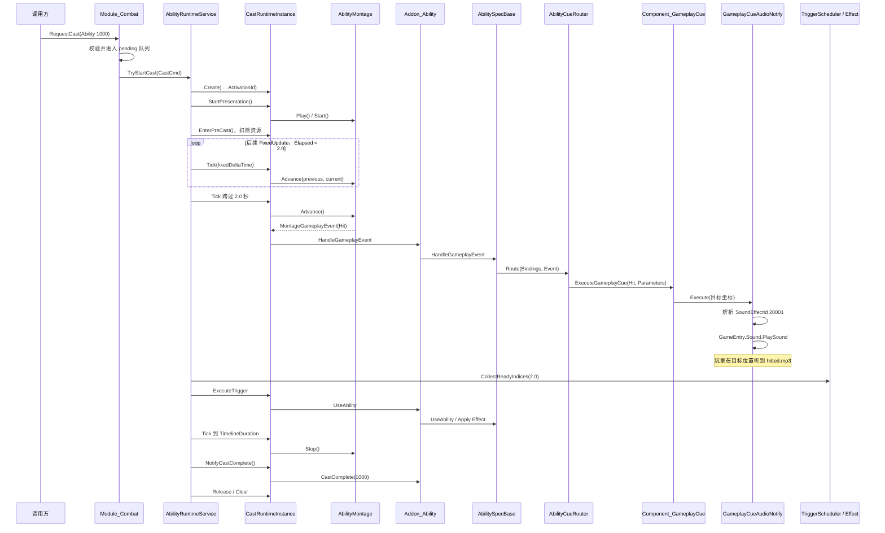
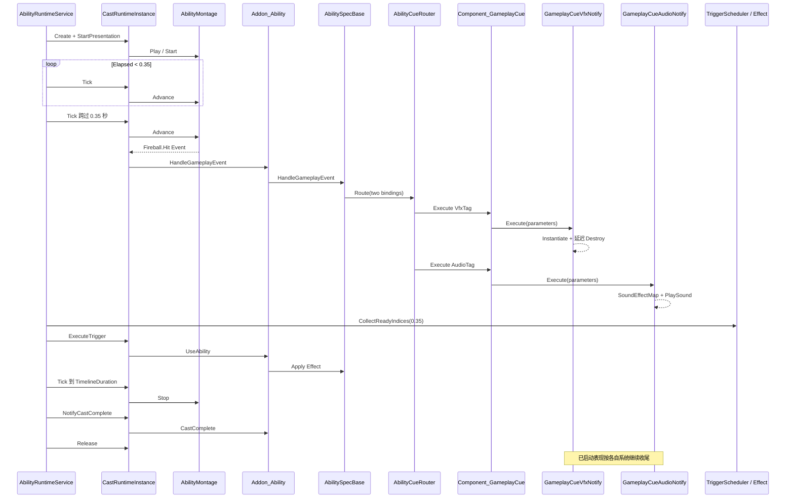

# GameplayCue 系统完整解析

> 本文以当前仓库代码为准，说明项目中参考 Unreal Engine GAS GameplayCue 思路实现的技能表现系统。内容覆盖运行时调用链、数据模型、索引与分发原理、编辑器和二进制持久化、资源注册、测试、现有限制，以及两个接入示例。
>
> 项目里的正式命名是 **GameplayCue**；下文将“Game Cue”统一写作“GameplayCue”。

## 目录

- [1. 系统定位与设计边界](#1-系统定位与设计边界)
- [2. 总体架构](#2-总体架构)
- [3. 模块、类和数据类型职责](#3-模块类和数据类型职责)
- [4. GameplayCue 在完整技能流程中的位置](#4-gameplaycue-在完整技能流程中的位置)
- [5. 各核心模块的实现原理](#5-各核心模块的实现原理)
- [6. 编辑器、二进制和资源注册链路](#6-编辑器二进制和资源注册链路)
- [7. 示例一：Ability 1000 从开始施法到命中音效播放，再到施法结束](#7-示例一ability-1000-从开始施法到命中音效播放再到施法结束)
- [8. 示例二：火球从开始施法到同一命中事件触发 VFX 和 Audio，再到表现自行结束](#8-示例二火球从开始施法到同一命中事件触发-vfx-和-audio再到表现自行结束)
- [9. 生命周期、错误隔离与性能特征](#9-生命周期错误隔离与性能特征)
- [10. 测试与验证](#10-测试与验证)
- [11. 当前限制和扩展建议](#11-当前限制和扩展建议)
- [12. 相关代码索引](#12-相关代码索引)

---

## 1. 系统定位与设计边界

GameplayCue 的职责是：**把技能运行过程中产生的语义事件，转换为不影响战斗结算的表现行为**。

当前已经落地的表现包括：

- 在指定世界坐标实例化 VFX Prefab；
- 在指定世界坐标播放音效；
- 一个技能事件触发多个 Cue；
- 一个 CueTag 触发多个 Notify；
- 通过点分层级 CueTag 复用父级通用表现；
- 单个表现失败时隔离异常，不中断其他表现和技能逻辑。

它不负责：

- 技能能否释放、Cost、CD；
- 伤害、治疗、Buff 等 Effect 结算；
- 目标选择；
- Timeline 资源加载本身；
- 网络同步、预测或回滚。

### 1.1 与 Unreal GAS GameplayCue 的相似点

| Unreal GAS 概念 | 当前项目对应物 | 相似点 |
| --- | --- | --- |
| Gameplay Ability Activation | `CastRuntimeInstance` | 表示一次独立施法，带 `ActivationId` 和生命周期。 |
| Animation Montage / Gameplay Event | `AbilityMontage` + `MontageGameplayEvent` | 在配置时间点发出带语义标签的事件。 |
| Gameplay Ability | `AbilitySpecBase` | 持有技能配置，解释事件并路由表现。 |
| GameplayCue Manager | `Component_GameplayCue` | 根据 CueTag 找到并执行表现。 |
| GameplayCue Notify | `GameplayCueNotifyBase` 及其子类 | 以可配置资产描述表现行为。 |
| GameplayTag 层级 | `GameplayCueTagIndex` 的点分字符串 | 精确 Tag 向父 Tag 逐级匹配。 |

### 1.2 与完整 GAS 的主要差异

当前实现是“借鉴 GameplayCue 的表现解耦模式”，不是完整 GAS 移植：

- Tag 是区分大小写的普通字符串，不是集中注册的 GameplayTag；
- 运行时只支持一次性 `Execute`；
- `Add` / `Remove`、持续 Cue、实例句柄清理尚未实现；
- 没有网络复制、预测确认、回滚、回放；
- Notify 只有一个 `Execute` 回调，没有 `OnActive`、`WhileActive`、`OnRemove` 等生命周期；
- 当前 VFX 直接 `Instantiate/Destroy`，没有 Cue Actor 池。

---

## 2. 总体架构

### 2.1 分层结构

```text
┌────────────────────────────────────────────────────────────┐
│ 技能请求与施法运行时                                       │
│ Module_Combat → AbilityRuntimeService → CastRuntimeInstance│
└──────────────────────────────┬─────────────────────────────┘
                               │ Elapsed / ActivationId / Targets
                               ▼
┌────────────────────────────────────────────────────────────┐
│ 时间事件层                                                  │
│ AbilityMontage → MontageGameplayEvent                      │
└──────────────────────────────┬─────────────────────────────┘
                               │ EventTag
                               ▼
┌────────────────────────────────────────────────────────────┐
│ 技能语义映射层                                              │
│ Addon_Ability → AbilitySpecBase → AbilityCueRouter          │
└──────────────────────────────┬─────────────────────────────┘
                               │ CueTag + GameplayCueParameters
                               ▼
┌────────────────────────────────────────────────────────────┐
│ Cue 查找与表现层                                            │
│ Component_GameplayCue → GameplayCueTagIndex                │
│                         → GameplayCueNotifyBase[]           │
│                         → VFX / Audio                       │
└────────────────────────────────────────────────────────────┘
```

### 2.2 核心解耦点

系统中存在两种不同的标签：

1. **EventTag**：描述技能运行时“发生了什么”。  
   例如：`Event.Ability.PhysicalAttack.Hit`。
2. **CueTag**：描述“应该播放哪类表现”。  
   例如：`GameplayCue.Ability.PhysicalAttack.Hit`。

两者由 `AbilityCueBindingData` 在每个 Ability 内进行映射：

```text
Montage Marker
    Event.Ability.PhysicalAttack.Hit
        │
        │ AbilityCueBindingData
        ▼
GameplayCue.Ability.PhysicalAttack.Hit
        │
        │ GameplayCueTagIndex
        ▼
PhysicalAttackHitAudio Notify
```

这样，`AbilityMontage` 不需要知道具体特效或声音，表现资产也不需要知道 Timeline 和 Effect 的内部逻辑。

---

## 3. 模块、类和数据类型职责

## 3.1 施法驱动层

| 类 / 模块 | 文件 | 作用 | 在 GameplayCue 流程中的职责 |
| --- | --- | --- | --- |
| `Module_Combat` | `Assets/Script/Modules/Module_Combat.cs` | 接收施法请求、维护待处理请求，并在 FixedUpdate 驱动施法服务。 | 是整个技能流程入口和时钟驱动者；不直接处理 Cue。 |
| `AbilityRuntimeService` | `Assets/Script/Fight/Pipeline/AbilityRuntimeService.cs` | 校验、创建、推进、完成、中断和回收一次施法。 | 生成递增 `ActivationId`，调用 `CastRuntimeInstance.Tick`，决定 Cue 时间轴何时开始与结束。 |
| `CastRuntimeInstance` | `Assets/Script/Fight/Pipeline/CastRuntimeInstance.cs` | 一次施法的运行时聚合对象，持有技能数据、施法者、目标、时间、状态机、TriggerScheduler 和 Montage。 | 创建 `AbilityMontage`，订阅它的 GameplayEvent，并把事件送给施法者的 `Addon_Ability`。 |
| `CastStateMachine` | `Assets/Script/Fight/Pipeline/CastStateMachine.cs` | 管理 PreCast、Channel、BackSwing、Completed、Interrupted。 | 完成或中断时停止 Montage，因此后续 Marker 不再触发 Cue。 |
| `TriggerScheduler` | `Assets/Script/Fight/Pipeline/TriggerScheduler.cs` | 根据技能时间调度 Effect Trigger。 | 与 Cue 共用施法时钟，但属于结算链；同一 FixedUpdate 中当前实现先触发 Cue，再执行 Effect。 |

## 3.2 时间事件与技能语义层

| 类 | 文件 | 作用 | 在技能流程中的职责 |
| --- | --- | --- | --- |
| `AbilityMontage` | `Assets/Script/Fight/Montage/AbilityMontage.cs` | 播放 Timeline，并按施法时间扫描 Montage Marker。 | 把静态 `MontageEventData` 转成带 Ability、Activation 和 Actor 信息的 `MontageGameplayEvent`。 |
| `Addon_Ability` | `Assets/Script/Fight/Addon/Addon_Ability/Addon_Ability.cs` | 管理 Actor 持有的 `AbilitySpecBase`。 | 根据事件里的 `AbilityId` 找到正确技能，再转发事件；技能不存在或未激活时跳过。 |
| `AbilitySpecBase` | `Assets/Script/Fight/Ability/AbilitySpec_Base.cs` | 技能逻辑实例，持有 `AbilityData`，同时负责 Effect、Cost、CD 等技能逻辑。 | 调用 `AbilityCueRouter`，并提供 Actor 位置解析和最终 Cue 执行入口。 |
| `AbilityCueRouter` | `Assets/Script/Fight/GameplayCue/AbilityCueRouter.cs` | 无状态事件路由器。 | 精确匹配 EventTag，应用目标/位置策略，生成 `GameplayCueParameters`，调用表现组件。 |

## 3.3 Cue 查找与表现层

| 类 | 文件 | 作用 | 实现方式 |
| --- | --- | --- | --- |
| `Component_GameplayCue` | `Assets/Extension/Component/Component_GameplayCue.cs` | 全局 GameplayCue Manager。 | 场景组件序列化持有 Notify 列表；`Awake` 建索引；执行时解析 Tag，并逐个调用 Notify。 |
| `GameplayCueTagIndex` | `Assets/Script/Fight/GameplayCue/GameplayCueTagIndex.cs` | Tag 校验、索引、父级解析和去重。 | `Dictionary<string, List<Notify>>` 保存映射，缓存父链，`HashSet` 按 Notify 引用去重。 |
| `GameplayCueNotifyBase` | `Assets/Script/Fight/GameplayCue/GameplayCueNotifyBase.cs` | 所有表现资产的抽象基类。 | `ScriptableObject` 保存只读暴露的 `_cueTag`，子类实现 `Execute`。 |
| `GameplayCueVfxNotify` | `Assets/Script/Fight/GameplayCue/GameplayCueVfxNotify.cs` | 一次性 VFX。 | 在参数位置实例化 Prefab，应用朝向、位置/旋转/缩放偏移，并按 LifeTime 销毁。 |
| `GameplayCueAudioNotify` | `Assets/Script/Fight/GameplayCue/GameplayCueAudioNotify.cs` | 一次性空间音效。 | 通过 LuBan `SoundEffectMap` 将声音 ID 解析为资产路径，再调用 `GameEntry.Sound.PlaySound`。 |
| `GameEntry.GameplayCue` | `Assets/Script/Entry/GameEntry.Custom.cs` | 全局组件访问点。 | 初始化时通过 UnityGameFramework `GameEntry.GetComponent<Component_GameplayCue>()` 取得场景组件。 |

## 3.4 配置与运行时数据类型

这些类型集中定义在：

`Assets/Script/Fight/GameplayCue/GameplayCueData.cs`

### `GameplayCueEventType`

```csharp
Execute = 0,
Add = 1,
Remove = 2
```

- `Execute`：当前唯一真正执行的事件类型；
- `Add` / `Remove`：已进入数据契约和二进制格式，但路由器会静默跳过，运行时未实现。

### `GameplayCueTargetPolicy`

| 值 | 行为 | 执行次数 |
| --- | --- | --- |
| `Caster` | 以施法者作为当前目标 | 1 次 |
| `PrimaryTarget` | 使用 `TargetActorIds[0]` | 目标存在时 1 次 |
| `EachTarget` | 对所有目标逐个生成参数并执行 | 每目标 1 次 |

### `GameplayCueLocationPolicy`

| 值 | `GameplayCueParameters.Location` 的基础位置 |
| --- | --- |
| `Source` | 施法者位置 |
| `Target` | 当前目标位置 |

最终位置还会叠加 Binding 的世界空间 `LocationOffset`。

### `MontageEventData`

编辑期 Marker 配置：

| 字段 | 作用 |
| --- | --- |
| `Time` | 相对本次施法开始的触发时间。 |
| `Sequence` | 同一时间点 Marker 的稳定排序号。 |
| `MarkerId` | Marker 实例标识，用于调试、测试和未来去重。 |
| `EventTag` | 发给 Ability 的语义事件标签。 |

### `AbilityCueBindingData`

Ability 内部的 Event→Cue 映射：

| 字段 | 作用 |
| --- | --- |
| `EventTag` | 要匹配的 Montage EventTag，使用 `StringComparison.Ordinal`。 |
| `CueTag` | 交给 `Component_GameplayCue` 的表现标签。 |
| `EventType` | 当前必须为 `Execute` 才会执行。 |
| `TargetPolicy` | Caster、PrimaryTarget 或 EachTarget。 |
| `LocationPolicy` | Source 或 Target。 |
| `Magnitude` | 表现强度参数，原样传入 Notify。内置 VFX/Audio 当前都没有使用它。 |
| `LocationOffset` | 叠加到 Source/Target 基础位置上的世界空间偏移。 |

### `MontageGameplayEvent`

运行时从 Montage 发出的值数据：

- `EventTag`、`MarkerId`、`EventTime`、`Sequence`；
- `AbilityId`、`ActivationId`；
- `SourceActorId`、`TargetActorIds`。

它不携带 `GameObject` 或 `Transform`，避免把表现对象耦合进技能事件。

### `GameplayCueParameters`

最终交给 Notify 的执行参数：

| 字段 | 来源 / 含义 |
| --- | --- |
| `AbilityId` | 当前技能 ID。 |
| `ActivationId` | 当前施法唯一 ID。 |
| `SourceActorId` | 施法者 Actor ID。 |
| `TargetActorId` | 按目标策略得到的当前 Actor ID。 |
| `Location` | 基础位置 + Binding LocationOffset。 |
| `Direction` | Source 指向当前 Target 的单位向量；重合时为零向量。 |
| `Magnitude` | Binding 配置值。 |
| `EventTime` | Marker 配置时间，而不是当前渲染帧时间。 |
| `Sequence` | Marker 的同时间排序号。 |

### `GameplayCueHandle` 与 `GameplayCueCommand`

这两个类型目前只有声明，没有生产代码引用：

- `GameplayCueHandle`：预留给持续 Cue 实例，含 Value、ActivationId、CueTag；
- `GameplayCueCommand`：预留给统一命令、网络或回放，含 EventType、CueTag、Parameters。

它们代表了后续 `Add/Remove` 扩展方向，不应被误认为现有功能已经可用。

---

## 4. GameplayCue 在完整技能流程中的位置

## 4.1 从技能请求到施法开始



关键点：

1. `Module_Combat.OnFixedUpdate` 先推进已有施法，再处理待执行队列，因此新请求在该 FixedUpdate 后半段开始。
2. `AbilityRuntimeService` 在所有前置校验通过后递增 `_nextActivationId`。
3. `CastRuntimeInstance` 创建 Montage 时，把 Ability 的 Marker 和初始目标 ID 传进去；`AbilityMontage.Initialize` 会克隆目标数组，因此 Montage Event 默认携带本次施法开始时的目标快照。
4. `AbilityMontage.Play` 先请求播放 Timeline，再立即调用 `Start`。
5. Cue 的时间依据是施法 `Elapsed`，不是 `PlayableDirector.time`。即使 Timeline 资产仍在异步加载，0 秒 Marker 也会立即按施法时钟触发。
6. 实现中 `Start()` 调用 `DispatchRange(0, 0, true)`，因此不只是 `Time == 0`，任何错误配置为负数的 Marker 也会在开始时派发。

## 4.2 FixedUpdate 中从 Marker 到 Notify



### 当前同一 FixedUpdate 内的顺序

`AbilityRuntimeService.FixedUpdate` 的实际顺序是：

1. `CastRuntimeInstance.Tick`；
2. `AbilityMontage.Advance` 派发 Cue；
3. `CastStateMachine.FixedUpdate`；
4. 回到 Service 后收集到期的 Effect Trigger；
5. `CastRuntimeInstance.ExecuteTrigger` 执行 Effect。

因此：**Cue Marker 和 Effect Clip 在同一 FixedUpdate 到期时，Cue 当前会先于 Effect 执行。** 这属于现有调用顺序，不代表二者有逻辑依赖。

## 4.3 完成和中断

- `CastRuntimeInstance.MarkCompleted` 和 `MarkInterrupted` 都会调用 `Montage.Stop()`；
- `AbilityMontage.Stop` 将 `_isPlaying` 设为 `false`，并停止/取消 Timeline 播放请求；
- 后续 `Advance` 因 `_isPlaying == false` 直接返回，不再产生 Cue；
- Runtime 回收前解绑 `Montage.GameplayEvent`，再通过 `ReferencePool` 回收 Montage；
- `AbilityMontage.Clear` 清空 Marker、目标、事件订阅、Activation 和 Timeline 请求状态。

注意：`AbilityMontage` 是一次施法的一次性推进器。`Stop` 后再次 `Start` 不会重置 `_nextMarkerIndex`，不能把它当作可从头重播的播放器。

---

## 5. 各核心模块的实现原理

## 5.1 `AbilityMontage`：稳定且不漏帧的 Marker 扫描

初始化时，Marker 被复制进内部列表，并按以下规则排序：

1. `Time` 升序；
2. 时间相同时按 `Sequence` 升序。

正常推进区间为：

```text
(previousTime, currentTime]
```

这意味着：

- FixedUpdate 步长很大时，中间的 Marker 仍会被 while 循环逐个派发；
- 已经落在 `previousTime` 及之前的 Marker 会被跳过；
- `_nextMarkerIndex` 保证每个 Marker 在一次施法内最多派发一次；
- `currentTime < previousTime` 时直接忽略，不支持倒放；
- 时间相同的多个 Marker 由 `Sequence` 提供确定顺序。

`MontageGameplayEvent` 中的 Actor 和 Activation 上下文在派发时一并写入，所以后续层不需要反向查询当前施法实例。

目标数组在 `AbilityMontage.Initialize` 中被克隆。`CastRuntimeInstance.RefreshTargets` 当前只更新 Runtime 的 `Targets`，不会同步改写 Montage 内部快照；如果未来支持施法中途换目标，需要明确 Cue 应使用初始目标还是实时目标，并同步调整这一边界。

## 5.2 `AbilityCueRouter`：从语义事件生成表现请求

路由器遍历当前 Ability 的 Binding，依次执行以下判断：

1. `binding.EventTag` 与 `gameplayEvent.EventTag` 必须按 Ordinal 完全相等；
2. `binding.EventType` 必须为 `Execute`；
3. 按 `TargetPolicy` 选择目标；
4. 解析 Source 和当前 Target 的世界坐标；
5. 计算 `Direction = normalize(target - source)`；
6. 按 `LocationPolicy` 选择 Source 或 Target；
7. 叠加 `LocationOffset`；
8. 构造 `GameplayCueParameters` 并调用 `execute(CueTag, Parameters)`。

同一个 EventTag 可以配置多个 Binding，执行顺序就是 Binding 列表顺序。

目标策略的细节：

- `Caster`：`TargetActorId` 也写为施法者 ID，方向通常为零；
- `PrimaryTarget`：目标数组为空时不执行；
- `EachTarget`：按目标数组顺序执行；
- `AbilitySpecBase.ResolveActorPosition` 找不到 Actor 时返回 `Vector3.zero`，当前不会记录警告。因此无效 Actor ID 可能让表现落在世界原点。

另外，Direction 使用的是未加 Offset 的 Source→Target 方向；Binding Offset 和 VFX Notify 自身的 PositionOffset 都不会改变 Direction。

## 5.3 `GameplayCueTagIndex`：层级 Tag 查找

### 建索引

`Build(notifies)` 会：

1. 清空 Tag 映射和父链缓存；
2. 检查列表中的每个 Notify 不为 null；
3. 校验 Notify 的 CueTag；
4. 把 Notify 追加到对应 Tag 的列表。

同一个 Tag 允许注册多个 Notify。列表顺序与 `Component_GameplayCue._notifies` 中的顺序一致。

### Tag 校验规则

当前合法性规则仅包括：

- 不能为 null、空串或全空白；
- 不能以 `.` 开头或结尾；
- 不能包含 `..`；
- 每个点分段不能有首尾空白。

Tag 不会被自动 Trim 或改大小写。比较器使用 `StringComparer.Ordinal`，所以大小写敏感。当前没有强制 `GameplayCue.` 根前缀，也没有禁止段内空格或特殊字符。

### 父级解析

执行：

```text
GameplayCue.Ability.Fire.Hit
```

得到的查找链是：

```text
GameplayCue.Ability.Fire.Hit
GameplayCue.Ability.Fire
GameplayCue.Ability
GameplayCue
```

规则是“从精确 Tag 向父级执行”，不会从父级反向搜索子级。

父链按完整 CueTag 缓存在 `_parentChainCache`。解析结果通过 `_resolvedNotifySet` 去重：同一个 ScriptableObject Notify 即使在匹配链中被重复引用，一次执行也只会调用一次。

## 5.4 `Component_GameplayCue`：全局分发和故障隔离

### 初始化

组件的 `_notifies` 是显式序列化列表。`Awake` 调用 `RebuildIndex()`，由 `GameplayCueTagIndex` 建立运行时索引。

如果在 `Awake` 之后通过编辑器脚本或运行时代码改动 `_notifies`，旧索引不会自动感知，必须再次调用公开方法 `RebuildIndex()`。

静态配置错误采用“尽早失败”：

- `_notifies` 含 null：建索引时抛出 `ArgumentException`；
- Notify CueTag 非法：建索引时抛出 `ArgumentException`。

### 运行时执行

`ExecuteGameplayCue(cueTag, parameters)`：

1. 先用 `GameplayCueTagIndex.IsValid` 做不抛异常的校验；
2. 非法 Tag 记录错误并返回，不影响战斗逻辑；
3. 解析精确与父级 Notify；
4. 逐个执行；
5. 每个 Notify 都有独立 `try/catch`。

某一个 Notify 抛异常时，日志包含：

- CueTag；
- AbilityId；
- ActivationId；
- Notify 资产名；
- 异常消息。

然后继续执行剩余 Notify。由此保证 VFX 或 Audio 的单点失败不会打断其他表现、Cost、CD 或 Effect。

如果 Tag 合法但没有任何注册 Notify，当前会静默结束，不打印“未找到”日志。

## 5.5 `GameplayCueNotifyBase`：资产化的表现策略

基类是 `ScriptableObject`：

```csharp
public abstract class GameplayCueNotifyBase : ScriptableObject
{
    public string CueTag => _cueTag;
    public abstract void Execute(in GameplayCueParameters parameters);

    [SerializeField]
    private string _cueTag;
}
```

设计含义：

- Notify 是共享配置资产，不是一次施法的运行时实例；
- Notify 不应把某次执行的 Actor、Transform、ActivationId 缓存在成员字段中；
- 每次执行所需上下文都通过 `GameplayCueParameters` 传入；
- 新表现类型通过继承基类扩展，不需要修改 Router 和 TagIndex。

## 5.6 `GameplayCueVfxNotify`

创建菜单：

```text
Aquila/GameplayCue/VFX Notify
```

执行步骤：

1. 以 `_rotationOffset` 创建基础旋转；
2. Direction 非零时，使用 `Quaternion.LookRotation(Direction) * rotationOffset`；
3. 在 `Parameters.Location + _positionOffset` 实例化 `_prefab`；
4. 将实例原始缩放与 `_scale` 分量相乘；
5. `_lifeTime > 0` 时延迟销毁；否则不自动销毁。

配置字段：

- `_prefab`；
- `_lifeTime`；
- `_positionOffset`；
- `_rotationOffset`；
- `_scale`。

当前没有 Prefab null 预校验，也没有对象池；实例化异常会被 Manager 捕获并记录。

## 5.7 `GameplayCueAudioNotify`

创建菜单：

```text
Aquila/GameplayCue/Audio Notify
```

执行链：

```text
_soundEffectId
    → GameEntry.LuBan.Tables.SoundEffectMap.GetOrDefault(id)
    → asset_path
    → PlaySoundParams.Create()
    → VolumeInSoundGroup = _volume
    → GameEntry.Sound.PlaySound(assetPath, group, priority=0, params, worldLocation)
```

配置字段：

- `_soundEffectId`：声音表 ID，而不是直接资产路径；
- `_soundGroup`：默认 `Effect`；
- `_volume`：0～1。

声音 ID 查不到或路径为空时，Notify 记录错误并跳过播放。`ResolveAssetPath` 和 `Play` 是 `protected virtual`，便于测试类替换数据表和声音系统。

---

## 6. 编辑器、二进制和资源注册链路

## 6.1 Ability 源资产

`AbilityEditorSOData` 中新增了两组序列化数据：

```csharp
[SerializeField] private List<MontageEventData> _montageEvents;
[SerializeField] private List<AbilityCueBindingData> _cueBindings;
```

并通过以下接口暴露：

- `IReadOnlyList<MontageEventData> MontageEvents`；
- `IReadOnlyList<AbilityCueBindingData> CueBindings`；
- `SetMontageEvents(...)`；
- `SetCueBindings(...)`。

`AbilityDataInspector` 最后调用 `DrawDefaultInspector()`，因此这两个私有 `[SerializeField]` 列表会直接显示在 Ability 资产 Inspector 中。

当前没有：

- GameplayCue 专用 Timeline Track；
- 专用 Marker 可视化轨道；
- CueTag 下拉注册表；
- 自定义 Binding Drawer。

也就是说，现阶段通过 Ability 资产默认 Inspector 或代码接口编辑 Marker 和 Binding。

> **Ability Editor 主窗口的生成按钮有一个重要边界**
>
> `AbilityEditorWindow.OnClickGenConfigBtn()` 调用 `AbilityConfigGenerator.Generate(this)` 后，只把元数据和 Timeline Track 交给 `AbilityDataExporter`：
>
> - 如果 `Assets/AbilityEditor/Editor/Config/Ability/<AbilityId>.asset` 已存在，`ExportToAsset()` 会复用旧资产；`UpdateAbilityData()` 没有改写 `_montageEvents/_cueBindings`，所以旧值会被“顺带保留”，但这不是显式的数据传递。
> - 如果资产不存在，`CreateAbilityData()` 新建的 SO 不会从窗口获得 Montage Event 和 Cue Binding，两个列表默认为空。
> - `ExportToSandBox()` 每次都会新建临时 `AbilityEditorSOData`，同样没有复制 Cue 数据。因此窗口勾选 `GenerateTempDataToggle` 后重生成 `sand_box.ablt`，会丢失 GameplayCue 的 Marker 和 Binding。
>
> 在这条生成路径修复前，配置 Cue 后应直接选中完整的 `AbilityEditorSOData` 资产，用其 Inspector 的 **Export Binary** 导出正式 `.ablt`；不要把窗口生成的沙盒文件当作 Cue 配置正确性的依据。

### 当前校验缺口

`AbilityEditorSOData.Validate` 会检查 Ability ID、TimelineDuration、Circle 半径和 Track 数据，但**不会语义校验**：

- Marker Time 是否为负数或超出 TimelineDuration；
- MarkerId / EventTag 是否为空或重复；
- CueTag 是否合法；
- EventType 是否为当前可执行的 Execute；
- EventTag 是否确实存在对应 Marker。

因此“导出通过”不等于 Cue 配置一定有效。

## 6.2 `.ablt` v5 导出

导出器：

`Assets/AbilityEditor/Editor/Tools/AbilityBinaryExporter.cs`

菜单：

```text
Aquila/AbilityEditor/.ablt Export|Import/Export all ability data(.ablt)
```

单个 Ability 也可以从 `AbilityDataInspector` 的按钮导出。

文件头：

```text
Magic   = "ABLT"
Version = 0x05
```

在基础字段和 Track 数据之后，按固定顺序追加：

```text
MontageEventCount: int32
repeat MontageEventCount:
    Time: float32
    Sequence: int32
    MarkerId: int32字节长度 + UTF-8
    EventTag: int32字节长度 + UTF-8

CueBindingCount: int32
repeat CueBindingCount:
    EventTag: int32字节长度 + UTF-8
    CueTag: int32字节长度 + UTF-8
    EventType: byte
    TargetPolicy: byte
    LocationPolicy: byte
    Magnitude: float32
    LocationOffset.x: float32
    LocationOffset.y: float32
    LocationOffset.z: float32
```

v5 的 Track 区只接受 Effect Clip（ClipType `1`）。旧 Audio/VFX ClipType `2/3` 已退役，表现统一由 GameplayCue 驱动。导出器遇到退役 ClipType 会拒绝导出，运行时读取器遇到非 Effect Clip 也会拒绝整个 Ability 文件。

## 6.3 运行时读取

存在两条读取路径，字段顺序必须和导出器完全一致：

| 读取器 | 文件 | 行为 |
| --- | --- | --- |
| `Component_AbilityPool.TryReadAbility` | `Assets/Extension/Component/Component_AbilityPool.cs` | 运行时组件读取 `.ablt`，生成 `AbilityData`。 |
| `Tools.Ability.ParseAbilityBinary` | `Assets/Script/Common/Tools/Tools.Ability.cs` | 工具/另一运行时入口读取 `.ablt`，生成 `AbilityData`。 |

两者均只接受 `ABLT + 0x05`，旧 v4 会被拒绝，不进行猜测性兼容。

`AbilityData` 将读取到的 Effect、Marker、Binding 保存为只读列表供 Runtime 和 AbilitySpec 使用。需要注意，`MontageEventData` 本身是可变 class，因此这里是列表只读和数组浅复制，不是深度不可变。

## 6.4 编辑器读取与一致性验证

| 工具 | 作用 |
| --- | --- |
| `AbilityBinaryReader` | 读取并打印 `.ablt`，会显示 Montage Events 和 Cue Bindings。 |
| `AbilityVerificationTool` | 临时导出后回读，并逐字段比较 Marker 与 Binding。 |
| `AbilityDataAssemblyVerifier` | 校验生产二进制组装出的 AbilityData。 |
| `AbilityVerificationMenu` | 菜单 `Aquila/AbilityEditor/Tools/Verify Ability Export`，串联导出回读和组装校验。 |
| `GameplayCuePresentationTests` | NUnit Editor 测试，覆盖索引、Marker、路由、二进制、Notify 和现有资源。 |
| `GameplayCueSelfTestRunner` | 不依赖 NUnit 入口的自检方法，成功时写入 `Temp/GameplayCueSelfTest.result`。 |

这里有一条需要区分的验证边界：`AbilityVerificationTool` 会比较 Montage Event 和 Cue Binding；`AbilityDataAssemblyVerifier` 当前构造 `AbilityData` 时只传基本字段和 Effect，既没有组装 Marker/Binding，也没有在比较阶段核对它们。因此 Assembly 阶段成功**不能单独证明** GameplayCue 数据完整，必须同时看 `AbilityVerificationTool` 或 GameplayCue 专项测试。

## 6.5 Notify 资源和场景注册

建议资源目录：

```text
Assets/Res/GameplayCue/
├── Skill/   # 技能专属表现
└── Global/  # 跨技能复用表现
```

目录只负责资源组织，运行时**不会扫描目录**。

当前 `Component_GameplayCue` 挂在两个场景的 `Timeline` GameObject 上：

- `Assets/Res/Scene/Start.unity`；
- `Assets/AbilityEditor/AbilityEditorEntry.unity`。

两个组件的 `_notifies` 当前都显式引用：

`Assets/Res/GameplayCue/Skill/PhysicalAttackHitAudio.asset`

因此新建 Notify 后还必须把它加入相关场景中 `Component_GameplayCue._notifies`：

```text
只创建 Notify 资产
    ≠ 自动生效
创建资产 + 注册到当前场景 Component_GameplayCue._notifies
    = 可被 TagIndex 查找到
```

若场景根本没有 `Component_GameplayCue`，`GameEntry.GameplayCue` 为 null；`AbilitySpecBase` 会记录组件缺失错误并跳过表现。

---

## 7. 示例一：Ability 1000 从开始施法到命中音效播放，再到施法结束

这一节不只列配置，而是沿着一次真实施法的时间线，说明物理攻击音效 Cue **什么时候触发、由谁触发、经过哪些类，以及施法结束后谁负责清理**。

这是当前仓库已经落地的示例，数据来源是：

- 源 Ability：`Assets/AbilityEditor/Editor/Config/Ability/1000.asset`；
- 生产二进制：`Assets/Res/Config/Ability/1000.ablt`；
- Audio Notify：`Assets/Res/GameplayCue/Skill/PhysicalAttackHitAudio.asset`；
- 音频资源：`Assets/Res/Audio/Fight/hitted.mp3`；
- 运行场景：`Assets/Res/Scene/Start.unity`。

## 7.1 施法开始前，系统已经准备好了什么

一次施法请求发生前，GameplayCue 并不是临时去磁盘搜索资源，而是依赖已经完成的三项初始化。

### 1. Ability 数据已进入运行时

`Component_AbilityPool` 从 `1000.ablt` 读取出 `AbilityData`。其中和本例有关的数据是：

| 数据 | 值 | 在流程中的意义 |
| --- | --- | --- |
| TimelineDuration | `5.0` | 这次施法 Runtime 正常持续到 5 秒 |
| Effect StartTime | `2.0` | 伤害 Effect 在 2 秒时进入结算链 |
| Marker Time | `2.0` | Montage 在 2 秒时发出表现语义事件 |
| Marker EventTag | `Event.Ability.PhysicalAttack.Hit` | 表示“物理攻击命中时刻” |
| Binding CueTag | `GameplayCue.Ability.PhysicalAttack.Hit` | 把命中语义映射为具体表现 Tag |
| TargetPolicy | `PrimaryTarget` | Cue 只对第一个目标执行一次 |
| LocationPolicy | `Target` | 表现在目标世界坐标发生 |

### 2. 施法者已经持有 AbilitySpec

施法者的 `Addon_Ability` 在初始化时根据 AbilityPool 创建并保存 `AbilitySpecBase`。因此后续收到 `AbilityId = 1000` 的 Montage Event 时，它能找到真正负责技能语义和 Cue Binding 的 Spec。

### 3. 场景已经建立 CueTag 索引

`Component_GameplayCue.Awake()` 调用 `RebuildIndex()`，把场景 `_notifies` 中的 `PhysicalAttackHitAudio.asset` 建入 `GameplayCueTagIndex`：

```text
GameplayCue.Ability.PhysicalAttack.Hit
    → PhysicalAttackHitAudio.asset
```

这一步说明为什么“只创建 Notify 资产”还不够：如果场景没有注册它，后面的路由即使生成了正确 CueTag，也找不到真正执行音效的对象。

## 7.2 这次施法中各类分别负责什么

| 类 / 模块 | 本次施法中的职责 |
| --- | --- |
| `Module_Combat` | 接受 `CastCmd`，做第一轮合法性、目标、Cost、CD 检查，并把请求放进待执行队列。 |
| `AbilityRuntimeService` | 创建和持有本次施法 Runtime，分配 `ActivationId`，逐 FixedUpdate 推进并在结束后回收。 |
| `CastRuntimeInstance` | 聚合本次施法的时间、施法者、目标、状态机、Effect 调度器和 Montage；它是一次施法的运行时主体。 |
| `CastStateMachine` | 管理 PreCast、Channel、BackSwing、Completed/Interrupted，决定何时结束施法。 |
| `TriggerScheduler` | 根据 Effect StartTime 判断伤害 Effect 何时到期；它不负责 Cue。 |
| `AbilityMontage` | 根据 Marker Time 扫描并发出 `MontageGameplayEvent`；它是本例音效 Cue 的直接时间触发者。 |
| `Addon_Ability` | 根据事件中的 AbilityId 找到施法者持有的 `AbilitySpecBase`。 |
| `AbilitySpecBase` | 取得该技能的 Cue Binding，调用 Router，并提供 Actor 坐标解析和场景 Cue 组件入口。 |
| `AbilityCueRouter` | 将 EventTag 精确匹配到 Cue Binding，选择主目标并生成 `GameplayCueParameters`。 |
| `Component_GameplayCue` | 根据 CueTag 找 Notify，逐个执行并隔离单个 Notify 异常。 |
| `GameplayCueAudioNotify` | 将 SoundEffectId 解析为音频路径，并真正调用 Sound 组件在世界坐标播放音效。 |

## 7.3 阶段一：玩家发起请求，但此时还没有播放音效

调用方先创建包含施法者、目标和 `AbilityId = 1000` 的 `CastCmd`，再调用：

```text
Module_Combat.RequestCast(CastCmd)
```

`RequestCast` 在这里做两件事：

1. 检查命令、施法者、目标、`Addon_Ability`、技能是否激活、Cost 和 CD；
2. 校验通过后调用 `EnqueueCast`，把命令放进 `_pendingCastByCaster`。

需要特别注意：**RequestCast 接受请求不等于技能已经开始，更不等于 Cue 已经触发。** 此时还没有 `CastRuntimeInstance`，也没有 Montage 时间。

## 7.4 阶段二：战斗 FixedUpdate 正式创建本次施法

`Module_Combat.OnFixedUpdate()` 的顺序是：

```text
AbilityRuntimeService.FixedUpdate()   // 先推进已有施法
DrivePendingQueue()                   // 再启动待执行请求
```

当 `DrivePendingQueue()` 处理 Ability 1000 时，会调用 `AbilityRuntimeService.TryStartCast()`。这个方法再次做运行时校验，然后完成以下工作：

1. 从 `GameEntry.AbilityPool` 取得 Ability 1000 的 `AbilityData`；
2. 递增 `_nextActivationId`，让本次施法拥有唯一 `ActivationId`；
3. 调用 `CastRuntimeInstance.Create(...)`；
4. 将 Runtime 放进 `_activeRuntimeByCaster`；
5. 调用 `CastRuntimeInstance.StartPresentation()`；
6. 让 `CastStateMachine` 进入 PreCast，并通过 `DeductResourceOnce()` 扣除技能消耗；
7. 让英雄 FSM 进入 `ABILITY_STATE`。

`CastRuntimeInstance.Create` 又创建了三个与本次施法绑定的对象：

- `TriggerScheduler`：记住 Effect 在 2 秒到期；
- `CastStateMachine`：根据 Effect 与 TimelineDuration 算出阶段边界；
- `AbilityMontage`：复制 Marker、AbilityId、ActivationId、施法者 ID 和初始目标 ID 快照。

随后 `StartPresentation()` 调用：

```text
AbilityMontage.Play
    → GameEntry.Timeline.Play
    → AbilityMontage.Start
```

`Start()` 会立即检查 0 秒 Marker。本例 Marker 在 2 秒，所以这一步没有音效。由于新 Runtime 是在本次 `AbilityRuntimeService.FixedUpdate` 之后才创建的，它要到后续 FixedUpdate 才开始增加 `Elapsed`。

## 7.5 阶段三：Elapsed 从 0 推进到 2 秒之前

后续每个 FixedUpdate，`AbilityRuntimeService` 都调用：

```text
CastRuntimeInstance.Tick(fixedDeltaTime)
```

`Tick` 内部的顺序是：

1. 保存上一帧 `previousElapsed`；
2. 增加 `Elapsed`；
3. 调用 `AbilityMontage.Advance(previousElapsed, Elapsed)` 扫描 Marker；
4. 调用 `CastStateMachine.FixedUpdate()` 推进施法阶段。

只要时间区间还没有跨过 2 秒，`AbilityMontage` 就不会发出 `Event.Ability.PhysicalAttack.Hit`。因此 Timeline 可以已经在播放攻击动作，但 GameplayCue 音效仍然不会提前出现。

## 7.6 阶段四：Elapsed 跨过 2 秒，音效 Cue 被完整触发

这是本例最核心的一帧。假设上一帧时间小于 2 秒，本帧时间达到或超过 2 秒，调用顺序如下。

### 第一步：`AbilityMontage` 判定 Marker 到期

`AbilityMontage.Advance()` 调用 `DispatchRange()`，找到 Time 为 2 秒的 Marker，并构造：

```text
MontageGameplayEvent
├── EventTag      = Event.Ability.PhysicalAttack.Hit
├── MarkerId      = physical_attack_hit
├── EventTime     = 2.0
├── AbilityId     = 1000
├── ActivationId  = 本次施法唯一 ID
├── SourceActorId = 施法者
├── TargetActorIds= 施法开始时复制的目标数组
└── Sequence      = 0
```

因此，**直接决定“现在该触发命中表现”的类是 `AbilityMontage`**。它只产生技能语义事件，还不知道最后播放音效还是特效。

### 第二步：`CastRuntimeInstance` 把事件送回施法者技能系统

`CastRuntimeInstance` 在初始化时订阅了 `Montage.GameplayEvent`。Marker 派发后进入：

```text
CastRuntimeInstance.OnMontageGameplayEvent
    → Castor.GetAddon<Addon_Ability>()
    → Addon_Ability.HandleGameplayEvent
```

`Addon_Ability` 使用事件里的 `AbilityId = 1000` 找到正确的 `AbilitySpecBase`。它的作用是避免事件被错误地交给施法者持有的其他技能。

### 第三步：`AbilitySpecBase` 把技能语义交给 Cue Router

`AbilitySpecBase.HandleGameplayEvent()` 调用：

```text
AbilityCueRouter.Route(
    Ability 1000 的 CueBindings,
    MontageGameplayEvent,
    ResolveActorPosition,
    ExecuteGameplayCue)
```

在这里，`AbilitySpecBase` 是技能数据和通用 Cue 系统之间的桥梁：

- 它提供 Ability 1000 的 Binding；
- 它提供 ActorId → 世界坐标的解析函数；
- 它提供最终调用 `GameEntry.GameplayCue` 的执行函数。

### 第四步：`AbilityCueRouter` 生成本次音效的参数

Router 遍历 Binding，找到 `EventTag` 与本次事件完全相等的记录：

```text
Event.Ability.PhysicalAttack.Hit
    → GameplayCue.Ability.PhysicalAttack.Hit
```

然后根据 Binding 计算：

- `TargetPolicy = PrimaryTarget`：取 `TargetActorIds[0]`；
- `LocationPolicy = Target`：Location 使用目标世界坐标；
- `Direction`：施法者位置指向目标位置的单位方向；
- `LocationOffset = (0,0,0)`：不额外偏移；
- `Magnitude = 1`：原样写入参数，本例 Audio Notify 暂不使用它。

最终生成 `GameplayCueParameters`，再调用：

```text
AbilitySpecBase.ExecuteGameplayCue
    → GameEntry.GameplayCue.ExecuteGameplayCue(
          "GameplayCue.Ability.PhysicalAttack.Hit",
          parameters)
```

### 第五步：`Component_GameplayCue` 根据 Tag 找到 Audio Notify

`Component_GameplayCue` 先验证 CueTag，再调用 `GameplayCueTagIndex.Resolve()`。本例会解析到场景预先注册的：

```text
PhysicalAttackHitAudio.asset
```

Manager 随即调用该资产的 `Execute(parameters)`。如果同一 CueTag 下还有其他 Notify，也会依照索引结果继续执行；单个 Notify 抛异常只会被记录，不会中断技能和后续 Notify。

### 第六步：`GameplayCueAudioNotify` 真正播放声音

`GameplayCueAudioNotify.Execute()` 执行：

```text
SoundEffectId 20001
    → SoundEffectMap.GetOrDefault(20001)
    → Assets/Res/Audio/Fight/hitted.mp3
    → PlaySoundParams.VolumeInSoundGroup = 1
    → GameEntry.Sound.PlaySound(..., Location = 目标世界坐标)
```

到这里，玩家才真正听到命中音效。也就是说：

> **技能表现的时间由 `AbilityMontage` Marker 决定；表现类型由 `AbilityCueBindingData` 决定；具体如何播放由 `GameplayCueAudioNotify` 决定。**

## 7.7 同一帧的 Effect 为什么在音效之后结算

Ability 1000 的 Effect StartTime 也是 2 秒，但 Cue 和 Effect 使用两条并行调度链：

```text
Cue：    CastRuntimeInstance.Tick
          → AbilityMontage.Advance
          → MontageGameplayEvent
          → GameplayCue

Effect： CastRuntimeInstance.Tick 返回后
          → TriggerScheduler.CollectReadyIndices
          → CastRuntimeInstance.ExecuteTrigger
          → Addon_Ability.UseAbility
          → AbilitySpecBase.UseAbility
          → Effect Apply / Impact
```

因此在当前代码中，这一 FixedUpdate 的真实顺序是：

1. 命中音效 Cue 播放；
2. `CastStateMachine` 从 PreCast 进入 BackSwing；
3. `AbilityRuntimeService` 收集到 2 秒 Effect；
4. `CastRuntimeInstance.ExecuteTrigger()` 对目标执行 Effect；
5. 伤害结果通过 `EventArg_OnHitAbility` 对外派发。

这里的音效表达的是“时间轴认为命中时刻到了”，而不是“伤害系统已经确认命中”。如果未来需要根据 Miss、暴击或格挡播放不同音效，就不能只依赖当前 Marker Cue，需要把战斗结算结果再转换为另一类表现事件。

## 7.8 阶段五：从 2 秒到 5 秒，最后正常结束并回收

2 秒之后没有更多 Marker，`CastRuntimeInstance` 仍在 BackSwing 阶段推进。等 `Elapsed` 达到 `TimelineDuration = 5`：

1. `CastStateMachine.FixedUpdate()` 将阶段改为 `Completed`；
2. `CastRuntimeInstance.MarkCompleted()` 把 `IsCompleted` 设为 true，并调用 `AbilityMontage.Stop()`；
3. `AbilityMontage.Stop()` 通过 `GameEntry.Timeline.Stop()` 停止这次 Timeline 播放请求；
4. `AbilityRuntimeService` 调用 `NotifyCastComplete()`；
5. `Addon_Ability.CastComplete(1000)` 发出 `OnCastComplete`；
6. 正常英雄流程中，`ActorState_HeroAbility` 收到完成事件并切回 `IDLE_STATE`；
7. Service 从活动字典移除 Runtime，并通过 `ReferencePool.Release` 回收它；
8. `CastRuntimeInstance.Clear()` 解绑 Montage 事件，释放 Montage、StateMachine、TriggerScheduler 和 CastCmd。

音效是一次性 `Execute` Cue，不由 `CastRuntimeInstance` 保存 Handle。施法结束只清理施法 Runtime，不会向声音系统发送 GameplayCue Remove；声音播放完成后的生命周期由 GameFramework Sound 系统管理。

## 7.9 如果施法中途被打断

- **2 秒之前中断**：`CastStateMachine.Interrupt()` → `MarkInterrupted()` → `AbilityMontage.Stop()`，Marker 尚未派发，因此不会播放命中音效。
- **2 秒之后中断**：音效已经执行，当前系统不会撤回或停止这个一次性 Cue；中断只阻止后续尚未到期的 Marker。

这也解释了为什么代码虽然预留了 `Add/Remove` 和 `GameplayCueHandle`，但当前一次性 Audio Cue 并不参与施法结束清理。

## 7.10 本例完整时序图



---

## 8. 示例二：火球从开始施法到同一命中事件触发 VFX 和 Audio，再到表现自行结束

这个例子用于展示**一个 Montage Event 如何在同一帧展开成两个不同表现**。它是基于现有 API 的接入示例，不是仓库中已经存在的正式 Fireball 资产。

为了把流程讲完整，假设该技能有以下数据：

| 配置 | 示例值 | 作用 |
| --- | --- | --- |
| AbilityId | `9001` | 标识这次示例技能 |
| TimelineDuration | `1.2` 秒 | 施法 Runtime 的正常结束时间 |
| Marker Time | `0.35` 秒 | 火球到达命中表现时刻 |
| Marker EventTag | `Event.Ability.Fireball.Hit` | 一次“火球命中”语义事件 |
| Effect StartTime | `0.35` 秒 | 示例中伤害与表现位于同一时间点 |

同一个 EventTag 配置两个 Binding，列表顺序是 VFX 在前、Audio 在后：

| 顺序 | CueTag | TargetPolicy | LocationPolicy | LocationOffset |
| --- | --- | --- | --- | --- |
| 0 | `GameplayCue.Ability.Fireball.Hit.Vfx` | `PrimaryTarget` | `Target` | `(0,1,0)` |
| 1 | `GameplayCue.Ability.Fireball.Hit.Audio` | `PrimaryTarget` | `Target` | `(0,0,0)` |

场景 `Component_GameplayCue._notifies` 需要注册两个资产：

| Notify | 关键配置 | 职责 |
| --- | --- | --- |
| `GameplayCueVfxNotify` | 火球爆炸 Prefab、LifeTime `1.5` | 在参数位置生成爆炸对象，设置朝向和缩放，延迟销毁 |
| `GameplayCueAudioNotify` | 爆炸 SoundEffectId、Group `Effect` | 从声音表解析路径，在参数位置播放空间音效 |

## 8.1 阶段一：请求、创建 Runtime 和开始 Timeline

火球与 Ability 1000 共用同一套施法入口：

```text
调用方创建 CastCmd
    → Module_Combat.RequestCast
    → pending 队列
    → Module_Combat.OnFixedUpdate
    → AbilityRuntimeService.TryStartCast
    → CastRuntimeInstance.Create
```

在 `TryStartCast` 中：

1. AbilityPool 提供示例 Ability 9001 的 `AbilityData`；
2. Service 分配本次唯一 `ActivationId`；
3. Runtime 创建 `TriggerScheduler`、`CastStateMachine` 和 `AbilityMontage`；
4. `StartPresentation()` 请求播放火球 Timeline；
5. `EnterPreCast()` 扣除资源；
6. 后续 FixedUpdate 开始推进 `Elapsed`。

这里还没有直接调用 VFX 或 Audio。施法层只准备了“0.35 秒时要发出 Fireball.Hit”这一时间语义。

## 8.2 阶段二：0.35 秒之前，动作在播但两个 Cue 都不执行

每个 FixedUpdate 都先进入 `CastRuntimeInstance.Tick()`，再由 `AbilityMontage.Advance()` 检查时间区间。只要还没跨过 0.35 秒：

- `GameplayCueVfxNotify.Execute()` 不会调用；
- `GameplayCueAudioNotify.Execute()` 不会调用；
- 伤害 Effect 也没有到达 TriggerScheduler 的触发时间。

这说明 VFX/Audio 的启动不是由 Prefab、声音资产或 Timeline 播放完成回调决定，而是由 `AbilityMontage` 对 Marker 时间的扫描决定。

## 8.3 阶段三：0.35 秒 Marker 到期，一个事件进入技能语义层

`AbilityMontage.DispatchRange()` 构造一个 `MontageGameplayEvent`：

```text
EventTag      = Event.Ability.Fireball.Hit
MarkerId      = fireball_impact
EventTime     = 0.35
AbilityId     = 9001
ActivationId  = 本次施法 ID
SourceActorId = 火球施法者
TargetActorIds= 施法开始时复制的目标数组
```

事件经过：

```text
AbilityMontage
    → CastRuntimeInstance.OnMontageGameplayEvent
    → Addon_Ability.HandleGameplayEvent
    → AbilitySpecBase.HandleGameplayEvent
    → AbilityCueRouter.Route
```

到 `AbilityCueRouter` 之前，系统只知道“火球命中事件发生了”；真正把它拆成爆炸特效和爆炸音效的是两条 `AbilityCueBindingData`。

## 8.4 阶段四：Router 先执行 VFX Binding

Router 按 Binding 列表顺序先处理：

```text
Event.Ability.Fireball.Hit
    → GameplayCue.Ability.Fireball.Hit.Vfx
```

它取主目标并计算：

- `sourcePosition`：施法者世界位置；
- `targetPosition`：主目标世界位置；
- `Direction`：施法者指向目标；
- `Location`：目标位置加 Binding Offset `(0,1,0)`。

然后调用：

```text
AbilitySpecBase.ExecuteGameplayCue
    → Component_GameplayCue.ExecuteGameplayCue(VfxTag, parameters)
```

`GameplayCueTagIndex` 找到 VFX Notify 后，`GameplayCueVfxNotify.Execute()`：

1. 用 `Direction` 计算朝向；
2. 在 `Parameters.Location + Notify.PositionOffset` 实例化爆炸 Prefab；
3. 叠加 RotationOffset 和 Scale；
4. LifeTime 大于 0 时调用 `Destroy(instance, lifeTime)`。

因此，VFX 的**触发时间**来自 Montage Marker，**世界位置**来自 Binding，**Prefab、二次偏移、旋转、缩放和存活时间**来自 VFX Notify 资产。

## 8.5 阶段五：同一个事件继续执行 Audio Binding

VFX 调用返回后，Router 继续处理列表中的第二条 Binding：

```text
Event.Ability.Fireball.Hit
    → GameplayCue.Ability.Fireball.Hit.Audio
```

这次仍取主目标，但 Offset 为零，所以 `GameplayCueParameters.Location` 是目标原点。随后：

```text
AbilitySpecBase.ExecuteGameplayCue
    → Component_GameplayCue.ExecuteGameplayCue(AudioTag, parameters)
    → GameplayCueAudioNotify.Execute
    → SoundEffectMap 查询爆炸 SoundEffectId
    → GameEntry.Sound.PlaySound(目标位置)
```

两个 Binding 是在同一次 `AbilityCueRouter.Route()` 中同步、顺序执行的。因此这一帧的表现顺序是：

1. 创建火球爆炸 VFX；
2. 播放火球爆炸 Audio；
3. Router 返回到 `AbilitySpecBase`；
4. Montage Event 调用链返回到 `CastRuntimeInstance.Tick()`。

如果 VFX Notify 在执行时抛异常，`Component_GameplayCue` 会捕获并记录；Router 随后仍会处理 Audio Binding，所以一个坏掉的 Prefab 不必然让爆炸音效也消失。

## 8.6 同帧伤害 Effect 在两个 Cue 之后执行

假设火球伤害 Effect 的 StartTime 同样是 0.35 秒，`AbilityRuntimeService` 的当前顺序仍然是：

```text
CastRuntimeInstance.Tick
    → Montage 派发一次 Fireball.Hit
    → Router 执行 VFX Cue
    → Router 执行 Audio Cue
    → Tick 返回
    → TriggerScheduler 收集 0.35 秒 Effect
    → CastRuntimeInstance.ExecuteTrigger
    → AbilitySpecBase.UseAbility
    → Effect 进入伤害结算
```

所以这个例子里的爆炸 VFX 和音效依旧表示“时间轴到达命中点”，不是对伤害结果的确认。若 Effect 最终 Miss，现有实现仍会播放这两个 Cue。

## 8.7 阶段六：施法 Runtime 结束，但已经生成的表现独立收尾

当 `Elapsed` 达到 TimelineDuration：

1. `CastStateMachine` 进入 Completed；
2. `CastRuntimeInstance.MarkCompleted()` 停止 `AbilityMontage` 和 Timeline；
3. `AbilityRuntimeService` 通知 `Addon_Ability.CastComplete`；
4. 英雄技能状态返回 Idle；
5. Runtime、Montage、StateMachine、TriggerScheduler 和 CastCmd 被回收。

但是已经创建的两个表现不由 Runtime 统一管理：

- VFX Prefab 继续存在，直到 `GameplayCueVfxNotify` 安排的 LifeTime 到期后由 Unity 销毁；
- Audio 交给 GameFramework Sound 系统继续播放；
- Runtime 结束不会发送 `Remove`，因为当前只实现一次性 `Execute` Cue。

因此可能出现“施法 Runtime 已经结束，但爆炸余焰或声音尾部仍在播放”的正常情况。表现生命周期和施法对象生命周期是解耦的。

## 8.8 如果火球施法被打断

- **Marker 前中断**：`MarkInterrupted()` 会停止 Montage，0.35 秒 Marker 不会再派发，VFX 和 Audio 都不会创建。
- **VFX 已执行、Audio 尚未执行时发生普通外部中断**：当前调用链是同一主线程同步调用，外部逻辑通常没有机会插入两个 Binding 中间；Router 会完成本次事件分发。
- **Marker 后中断**：已经实例化的 VFX 和已经播放的 Audio 不会被撤销，只有未来 Marker 被阻止。

如果未来需要“引导技能被打断时立即停止循环特效/音效”，就需要真正实现 `Add`、`Remove`、`GameplayCueHandle` 和按 `ActivationId` 清理的持续 Cue 管理。

## 8.9 父 Tag 在这个双 Binding 流程中的实际效果

假设场景还注册了：

```text
GameplayCue.Ability.Fireball.Hit
```

VFX 子 Tag 解析时会执行：

```text
GameplayCue.Ability.Fireball.Hit.Vfx
    → GameplayCue.Ability.Fireball.Hit
```

Audio 子 Tag 解析时又会执行：

```text
GameplayCue.Ability.Fireball.Hit.Audio
    → GameplayCue.Ability.Fireball.Hit
```

父级 Notify 会执行两次，因为两个 Binding 分别调用了两次 `Component_GameplayCue.ExecuteGameplayCue()`；去重只发生在单次 Tag Resolve 内。若共享表现只应该执行一次，可以改为**只保留一条父 Tag Binding，并把要同时执行的多个 Notify 注册在该父 Tag 下**；不要同时保留两条子 Tag Binding 和一个有副作用的父级 Notify。

## 8.10 本例完整时序图



---

## 9. 生命周期、错误隔离与性能特征

## 9.1 生命周期

### 一次施法对象

以下对象通过 `ReferencePool` 复用：

- `CastRuntimeInstance`；
- `AbilityMontage`；
- `CastStateMachine`；
- `TriggerScheduler`。

一次施法结束时，Runtime 负责解绑 Montage 事件并回收内部对象。

### Notify 资产

Notify 是场景组件引用的共享 ScriptableObject，生命周期独立于单次施法。它们应该保持无运行时状态。

### VFX / Audio

- VFX：每次直接实例化，按 LifeTime 销毁；
- Audio：每次调用 GameFramework Sound 播放接口；
- 当前没有持续 Cue 实例表，也没有按 ActivationId 批量移除表现。

## 9.2 错误边界

| 情况 | 当前行为 | 是否中断战斗逻辑 |
| --- | --- | --- |
| 场景 Notify 列表包含 null | `Awake/RebuildIndex` 抛异常，暴露静态配置错误 | 可能影响场景初始化 |
| Notify 的 CueTag 非法 | 建索引时抛异常 | 可能影响场景初始化 |
| Ability Binding 的 CueTag 非法 | 执行时记录错误并跳过 | 否 |
| CueTag 合法但未注册 Notify | 静默无表现 | 否 |
| `GameEntry.GameplayCue` 缺失 | 记录错误并返回 | 否 |
| 单个 Notify 抛异常 | 记录错误，继续下一个 Notify | 否 |
| Audio 声音 ID 查不到 | 记录错误，跳过播放 | 否 |
| Actor ID 无法解析位置 | 当前返回世界原点，无专用错误 | 否，但表现位置可能错误 |
| 非 Execute Binding | Router 静默跳过 | 否 |

## 9.3 性能特征

已经做的优化：

- Tag→Notify 使用字典索引，不在每次 Cue 中扫描全部 Notify；
- 父 Tag 链按 CueTag 缓存；
- Resolve 输出 List 和去重 HashSet 被复用；
- Router 无状态，不创建长期对象；
- Marker 用有序列表和递增索引扫描，不会每帧从头遍历。

当前开销和注意点：

- VFX 每次 `Instantiate/Destroy`，高频技能可能产生 GC 和实例化峰值；
- 第一次解析某个新 CueTag 时会创建父链数组；
- `EachTarget` 会对每个目标重复解析 Source/Target 坐标并执行 Cue；
- `Component_GameplayCue` 复用内部 List/HashSet，因此按 Unity 主线程串行调用设计，既不是线程安全组件，也不支持在某个 Notify 的 `Execute` 内递归调用同一个组件的 `ExecuteGameplayCue`；递归解析会覆盖外层正在遍历的共享结果列表；
- Notify 资产和 Prefab 均靠场景直接引用，没有按需异步加载。

---

## 10. 测试与验证

## 10.1 NUnit Editor 测试

文件：

`Assets/Tests/Editor/GameplayCuePresentationTests.cs`

覆盖内容：

1. Tag 精确→父级顺序、多个 Notify、引用去重和非法 Tag；
2. 0 秒 Marker、大步长跨 Marker、同时间 Sequence 顺序和 Stop 后不触发；
3. Caster、PrimaryTarget、EachTarget 和 LocationOffset 参数；
4. `.ablt` v5 Marker/Binding 往返，v4 和退役 Clip 拒绝；
5. 所有生产 `.ablt` 的版本和双读取器可读性；
6. VFX 实例化；
7. Audio ID 解析、声音参数和世界坐标；
8. 单个 Notify 抛异常后的继续执行；
9. 声音 ID 缺失时记录错误并跳过；
10. Ability 1000 物理攻击音效从源资产、二进制、场景依赖到模拟执行的端到端配置。

可在 Unity Test Runner 中运行 `GameplayCuePresentationTests`。

## 10.2 自检入口

文件：

`Assets/AbilityEditor/Editor/Tools/GameplayCueSelfTestRunner.cs`

静态入口：

```text
Editor.AbilityEditor.Tools.GameplayCueSelfTestRunner.Run
```

它覆盖与 Editor NUnit 测试相近的关键路径。通过时：

- Console 输出 `[GameplayCueSelfTest] PASS`；
- 写入 `Temp/GameplayCueSelfTest.result`，内容为 `PASS`。

可用于 Unity batchmode 的 `-executeMethod`，但该类当前没有独立的 `MenuItem` 按钮。

## 10.3 导出一致性验证

菜单：

```text
Aquila/AbilityEditor/Tools/Verify Ability Export
```

该菜单串联两阶段验证：`AbilityVerificationTool` 对源 Ability 资产和临时导出文件逐字段比较，其中包括所有 Marker 和 Binding；`AbilityDataAssemblyVerifier` 的组装阶段当前不包含这两组数据。它能验证前一阶段的“Cue 序列化一致”，但 Assembly 成功本身不覆盖 Cue，也不替代 CueTag、EventTag 和时间范围的语义校验。

---

## 11. 当前限制和扩展建议

## 11.1 已实现能力

- [x] 一次性 `Execute` Cue；
- [x] VFX Notify；
- [x] 基于 SoundEffectMap ID 的 Audio Notify；
- [x] 点分层级 CueTag；
- [x] 一个 EventTag 对应多个 Cue Binding；
- [x] 一个 CueTag 对应多个 Notify；
- [x] Caster / PrimaryTarget / EachTarget；
- [x] Source / Target 和世界空间 Offset；
- [x] Marker 大步长不漏触发及同时间稳定排序；
- [x] 单 Notify 故障隔离；
- [x] `.ablt` v5 导出、双读取器和验证工具；
- [x] 现有物理攻击音效端到端配置。

## 11.2 尚未实现或只预留数据的能力

- [ ] `Add` / `Remove` 持续 Cue；
- [ ] `GameplayCueHandle` 的分配、保存和释放；
- [ ] 按 `ActivationId` 清理持续表现；
- [ ] 网络同步、客户端预测、确认和回滚；
- [ ] 回放、快照或 CueCommand 记录；
- [ ] VFX 对象池；
- [ ] Tag 注册表和编辑器下拉选择；
- [ ] GameplayCue 专用 Timeline/AbilityEditor 可视化轨道；
- [ ] Cue 资源自动发现、Addressables 或异步加载；
- [ ] Attach 到骨骼/挂点、跟随目标、地面法线等位置策略；
- [ ] Camera Shake、UI、材质、受击闪白等更多内置 Notify；
- [ ] Binding 和 Marker 的完整语义校验。

## 11.3 代码层已知注意点

1. **Magnitude 目前只是透传**：内置 VFX/Audio 没有使用它；Audio 音量由 Notify `_volume` 决定，VFX 尺寸由 Notify `_scale` 决定。
2. **Add/Remove 会被静默忽略**：数据能导出和读回，但不会产生运行时表现。
3. **Tag 大小写敏感**：`gameplaycue.X` 和 `GameplayCue.X` 是两个不同字符串。
4. **无 Notify 时静默**：配置拼写错误但仍符合 Tag 格式时，可能只表现为“没有效果”。
5. **位置解析失败回原点**：`ResolveActorPosition` 当前缺少 Actor 时返回 `Vector3.zero`。
6. **Marker 负时间会在 Start 触发**：现有 Validate 没有限制时间范围。
7. **父级 Notify 可能重复**：一个 Event 映射到多个同父系 CueTag 时，每次 Cue Resolve 都会独立触发父级。
8. **共享 ScriptableObject 必须无状态**：否则不同 Actor 或不同施法会互相污染。
9. **场景显式注册**：新场景、新 Notify 都需要检查 `_notifies` 和 `GameEntry.GameplayCue`。
10. **Cue 时钟与 Timeline 实际加载解耦**：资源加载延迟时，Cue 仍按施法 Elapsed 触发。
11. **运行时改注册表要重建索引**：修改 `_notifies` 后必须调用 `RebuildIndex()`。
12. **当前分发不可重入**：自定义 Notify 不应在 `Execute` 中直接递归触发同一个 `Component_GameplayCue`；如有嵌套需求，应先把解析结果复制为局部快照或增加命令队列。
13. **Ability Editor 沙盒导出会丢 Cue**：`ExportToSandBox()` 新建临时 SO 时只复制元数据和 Track，不复制 Montage Event / Cue Binding。
14. **Assembly 验证不覆盖 Cue**：`AbilityDataAssemblyVerifier` 当前忽略 Montage Event / Cue Binding，不能作为 Cue 数据完整性的证明。

## 11.4 推荐扩展顺序

### 第一阶段：提高配置可靠性

- 给 `AbilityEditorSOData.Validate` 增加 Marker 和 Binding 校验；
- 增加统一 Tag 注册表与选择器；
- 对“合法但无 Notify”的 CueTag提供开发环境警告；
- 检查 Marker 是否在 `[0, TimelineDuration]` 内；
- 检查 EventTag 是否存在至少一个 Marker 和一个 Binding。

### 第二阶段：提高表现性能和能力

- 为 VFX 增加对象池；
- 增加 Attach/Socket/Follow/SurfaceNormal 策略；
- 让内置 Notify按需使用 Magnitude；
- 增加 Camera/UI/Material 等 Notify。

### 第三阶段：持续 Cue

保持现有 EventTag→CueTag 调用链，扩展 Manager：

```text
GameplayCueCommand
    ├── Execute → 执行一次性 Notify
    ├── Add     → 创建持续实例，返回 GameplayCueHandle
    └── Remove  → 按 Handle / ActivationId 停止并清理
```

持续实例表建议至少以以下键管理：

```text
Handle.Value
ActivationId
CueTag
SourceActorId
TargetActorId
```

### 第四阶段：网络与回放

在 `GameplayCueCommand` 已稳定后，再把它作为可序列化命令用于：

- 权威端下发；
- 客户端预测与确认；
- 回滚去重；
- 战斗回放。

---

## 12. 相关代码索引

### GameplayCue 核心

```text
Assets/Script/Fight/GameplayCue/
├── GameplayCueData.cs
├── AbilityCueRouter.cs
├── GameplayCueTagIndex.cs
├── GameplayCueNotifyBase.cs
├── GameplayCueVfxNotify.cs
└── GameplayCueAudioNotify.cs
```

### 运行时接入

```text
Assets/Extension/Component/Component_GameplayCue.cs
Assets/Script/Entry/GameEntry.Custom.cs
Assets/Script/Fight/Montage/AbilityMontage.cs
Assets/Script/Fight/Pipeline/AbilityRuntimeService.cs
Assets/Script/Fight/Pipeline/CastRuntimeInstance.cs
Assets/Script/Fight/Pipeline/CastStateMachine.cs
Assets/Script/Fight/Pipeline/TriggerScheduler.cs
Assets/Script/Fight/Addon/Addon_Ability/Addon_Ability.cs
Assets/Script/Fight/Ability/AbilitySpec_Base.cs
Assets/Script/Fight/Ability/AbilityData.cs
Assets/Script/Modules/Module_Combat.cs
```

### 编辑器与二进制

```text
Assets/AbilityEditor/Editor/Ability/SOData/AbilityEditorSOData.cs
Assets/AbilityEditor/Editor/Inspector/AbilityDataInspector.cs
Assets/AbilityEditor/Editor/Tools/AbilityBinaryExporter.cs
Assets/AbilityEditor/Editor/Tools/AbilityBinaryReader.cs
Assets/AbilityEditor/Editor/Tools/AbilityVerificationTool.cs
Assets/AbilityEditor/Editor/Tools/AbilityDataAssemblyVerifier.cs
Assets/AbilityEditor/Editor/Tools/AbilityVerificationMenu.cs
Assets/Extension/Component/Component_AbilityPool.cs
Assets/Script/Common/Tools/Tools.Ability.cs
Assets/Script/Common/Tools/ByteWriter.cs
```

### 现有示例资源

```text
Assets/AbilityEditor/Editor/Config/Ability/1000.asset
Assets/Res/GameplayCue/Skill/PhysicalAttackHitAudio.asset
Assets/Res/Audio/Fight/hitted.mp3
Assets/Res/DataTables/common_soundeffectmap.bytes
Assets/Res/Config/Ability/1000.ablt
Assets/AbilityEditor/SandBox/sand_box.ablt
Assets/Res/Scene/Start.unity
Assets/AbilityEditor/AbilityEditorEntry.unity
```

### 测试

```text
Assets/Tests/Editor/GameplayCuePresentationTests.cs
Assets/AbilityEditor/Editor/Tools/GameplayCueSelfTestRunner.cs
```
